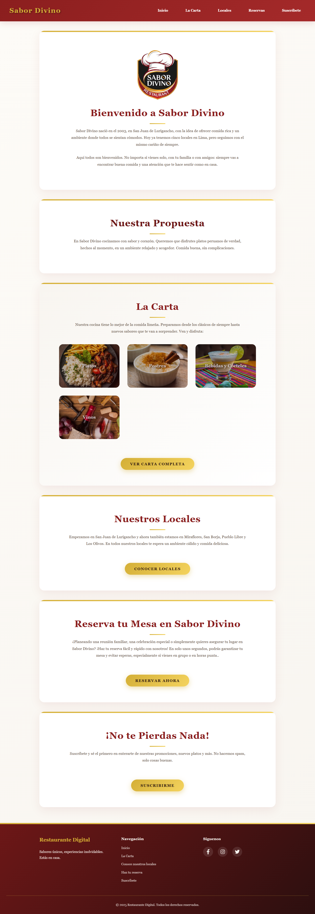
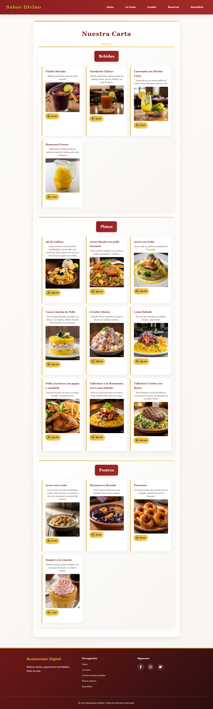

# 🍽️ Sabor Divino - Restaurante Web

Una moderna aplicación web para el restaurante *Sabor Divino, desarrollada con **React, **Vite* y *Supabase*. Esta plataforma permite a los usuarios explorar la carta digital, conocer los locales, realizar reservas y suscribirse a promociones.

---

### 🏠 Página de Inicio

---

### 🍽️ Carta Digital

---
## 🌟 Características

- 🍴 *Carta Digital:* Explora platos, bebidas y postres con imágenes y precios.
- 📍 *Locales:* Encuentra nuestras ubicaciones en Lima.
- 📅 *Sistema de Reservas:* Reserva tu mesa fácilmente.
- 📧 *Suscripciones:* Suscríbete para recibir promociones y novedades.
- 📱 *Diseño Responsivo:* Optimizado para móviles y escritorio.
- ⚡ *Rendimiento Superior:* Potenciado por Vite para una carga veloz.

---

## 🛠️ Tecnologías Utilizadas

- *Frontend:* React 18 + Vite  
- *Routing:* React Router DOM  
- *Base de Datos & Autenticación:* Supabase  
- *Almacenamiento de Imágenes:* Supabase Storage  
- *Estilos:* CSS3 personalizado  
- *Iconografía:* React Icons (Font Awesome)

---

## 🚀 Instalación y Ejecución

### Prerrequisitos
- Node.js (versión 16 o superior)
- npm o yarn
- Cuenta en Supabase

### Clonar el repositorio
bash
git clone https://github.com/alowincr/sabor-divino.git
cd sabor-divino

### Instalar dependencias
bash
npm install

### ⚙️ Configurar variables de entorno

1. Copia el archivo de ejemplo:
bash
cp .env.example .env

2. Rellena el archivo .env con tus datos de Supabase:
env
VITE_SUPABASE_URL=https://tu-proyecto.supabase.co
VITE_SUPABASE_ANON_KEY=tu_clave_anon_key_aquí

### Ejecutar en desarrollo
bash
npm run dev

La aplicación estará disponible en http://localhost:5173

---

## ✅ Funcionalidades por Sección

### 🏠 Página de Inicio
- Bienvenida e introducción al restaurante.
- Acceso rápido a las secciones principales.

### 🍽️ Carta Digital
- *Categorías*: Platos, Bebidas y Postres.
- Imágenes dinámicas desde Supabase Storage.
- Precios mostrados en formato local (PEN – Perú).

### 📍 Locales
- Lista dinámica de sucursales.
- Información detallada como dirección y contacto.

### 📅 Reservas
- Formulario con validación de campos.
- Datos almacenados automáticamente en Supabase.
- Confirmación visual de reserva exitosa.

### 📧 Suscripciones
- Newsletter para recibir promociones y novedades.
- Validación de correos electrónicos únicos.
- Mensaje de confirmación de suscripción exitosa.

---

## 🤝 Contribuir

1. Fork el proyecto
2. Crea una rama (git checkout -b feature/nueva-funcionalidad)
3. Commit tus cambios (git commit -m 'Agregada nueva funcionalidad')
4. Push a la rama (git push origin feature/nueva-funcionalidad)
5. Abre un Pull Request

---

## 👨‍💻 Autor

*Alonso Carbajal* - [@alowincr](https://github.com/alowincr)

---

⭐ *¡Dale una estrella si te gusta el proyecto!*

🍽️ *Sabor Divino* - Sabores únicos, experiencias inolvidables
